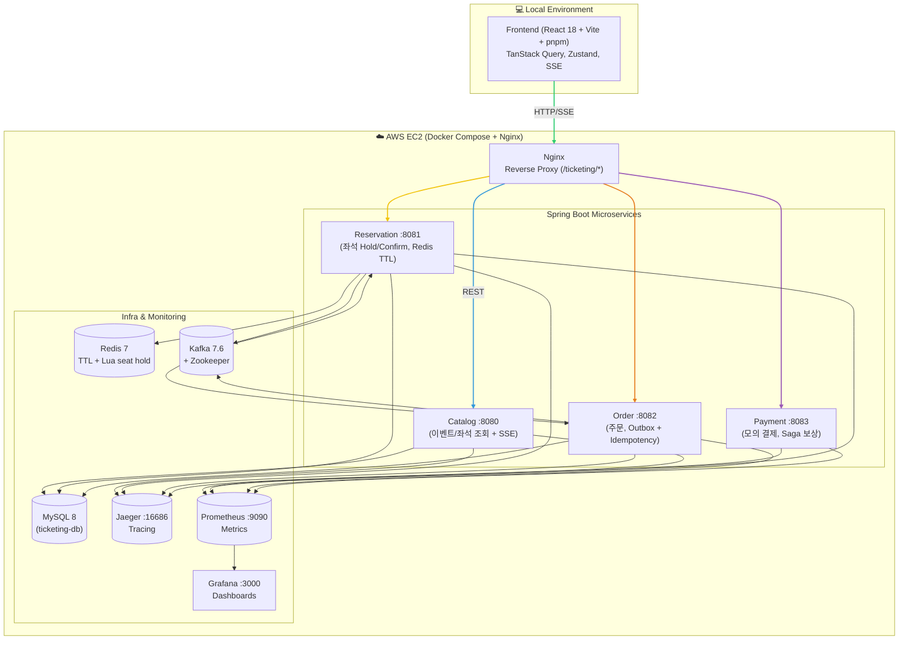
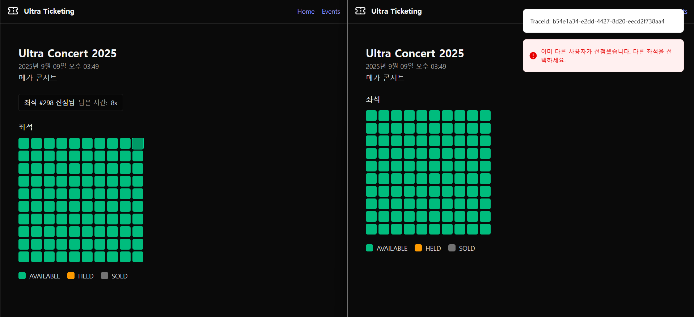
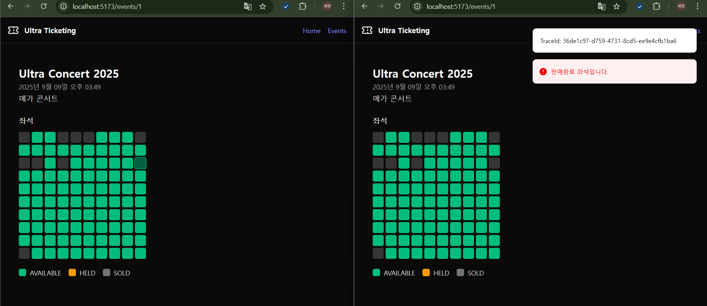
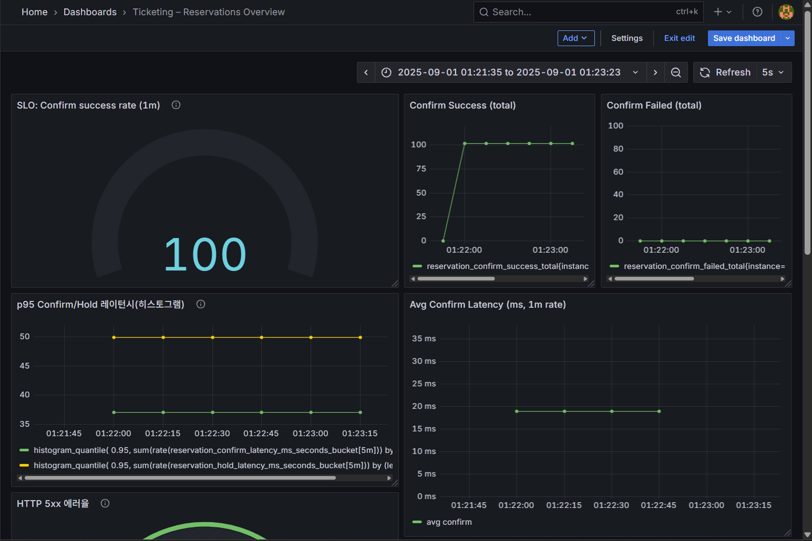

# 🎟️ 초고동시성 티켓 예매 시스템 (High-Concurrency Ticketing System)

 
 
 
 
 

## 📖 프로젝트 개요
실제 공연·영화 예매 사이트처럼 **1000명 동시 접속 환경에서 좌석 예매 충돌(oversell) 없이** 안정적으로 처리되는 시스템을 목표로 구현했습니다.  

- **핵심 주제**: 좌석 동시성 제어 & 이벤트 기반 주문/결제 흐름
- **목표 SLO**: Oversell = 0, p95 < 300ms, Error Rate < 0.5%
- **진행 기간**: 2025.08 ~ 2025.09 (융합프로젝트)

---

## ✨ 주요 기능
### Catalog (공연/좌석 조회)
- `GET /api/events` : 이벤트 목록 조회
- `GET /api/events/{id}/seats` : 좌석맵 조회
- `GET /api/events/{id}/seats/stream` : 좌석 상태 SSE 실시간 스트리밍

### Reservation (좌석 예약/홀드)
- Redis + Lua로 **원자적 hold/expire** 처리
- TTL 만료 자동 반납
- `POST /api/reservations` → 201/409/422 표준 에러 구조 반환

### Order (주문)
- `POST /api/orders` (Idempotency-Key 필수)  
- Outbox 패턴 + Kafka 발행 → eventual consistency 보장
- 다좌석 주문 지원

### Payment (결제)
- `POST /api/payments/authorize`  
- 랜덤 지연 + 80:20 성공/실패 시뮬레이션  
- Saga 패턴으로 실패 시 보상 트랜잭션 실행

### Frontend (React 18 + Vite)
- 좌석맵(SeatGrid) UI, 상태별 색상 표시
- 좌석 클릭 → hold → countdown → confirm 흐름
- CartDrawer & CheckoutPage → 주문 & 결제 UX
- SSE 기반 좌석 실시간 동기화

---

## 🏗️ 아키텍처

Backend: Java 21, Spring Boot 3.3, JPA, Redis 7, Kafka 7.6, MySQL 8

Frontend: React 18, TypeScript, Vite, TailwindCSS, shadcn/ui, TanStack Query, Zustand

Infra: Docker Compose, Nginx Proxy, GitHub Actions (CI/CD), GHCR

Observability: Micrometer → Prometheus, Grafana, Jaeger

테스트/품질: k6, JUnit5, Testcontainers, Playwright

📊 성능 개선 과정
Day05까지 반복 부하 테스트와 튜닝을 통해 다음과 같은 과정을 거쳤습니다Day05 (2025-09-27):

단계	주요 변경	평균 응답 시간	병목 구간
초기	Redis+DB 이중 검증	~1.48s	DB is-sold (~957ms)
Redis-only	DB 제거	~3.3s	Redis Lua (~824ms)
비동기 SSE	SSE 비동기화	~1.45s	Redis setnx (~151ms)
최종 안정화	Redis-only + 비동기 SSE	~1.41s	Redis setnx (~492ms)

➡️ DB 병목 제거 + SSE 비동기화로 초기 대비 성능/안정성 개선 달성.

🚀 실행 방법
bash
코드 복사
# Backend 모듈 빌드 & Docker 이미지 생성
./gradlew :catalog:jib
./gradlew :reservation:jib
./gradlew :order:jib
./gradlew :payment:jib

# Infra (MySQL/Redis/Kafka/Jaeger/Nginx) + BE 모듈 기동
cd infra
docker compose up -d

# Frontend 실행
cd frontend
pnpm install
pnpm dev
접속: http://localhost:5173

API: http://localhost:8080/ticketing/catalog/api/...

📸 스크린샷

📚 배운 점 & 한계
Redis TTL + Lua 스크립트로 oversell 방지를 직접 구현 → 동시성 제어 핵심 경험

Outbox + Saga 패턴으로 이벤트 기반 MSA 학습

Grafana/Jaeger로 성능 병목 시각화 → 개선 사이클 경험

단일 EC2 + Docker Compose 환경까지만 진행, Kubernetes/HPA/Canary까지는 미도입

📝 참고
Daily Logs (학습 과정 상세)

API 계약 문서

프론트엔드/백엔드 소스코드: 각 frontend/, ticketing/ 디렉토리 참조

yaml
코드 복사

---
